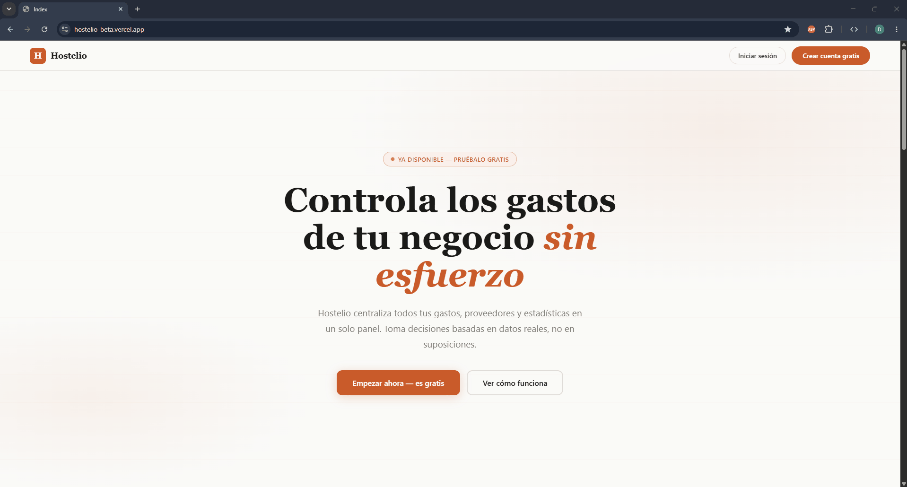
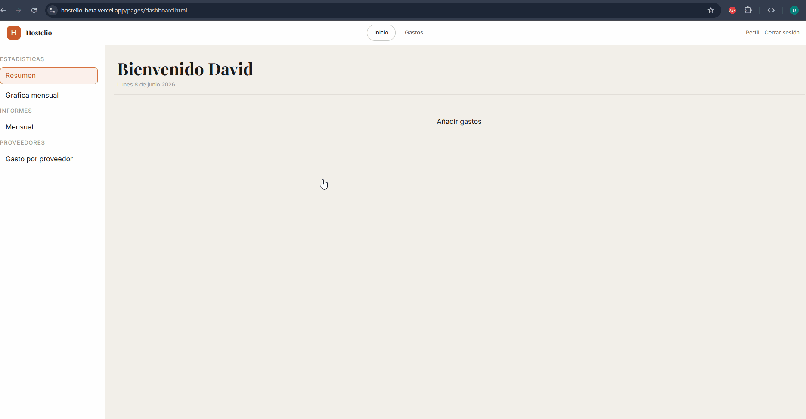
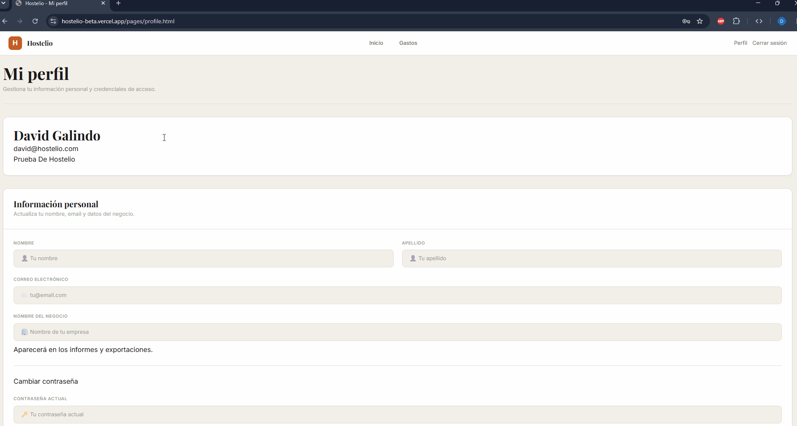

# 🏨 Hostelio

> Plataforma web de gestión de gastos empresariales


---

## 📋 Tabla de contenidos

- [Descripción](#-descripción)
- [Características](#-características)
- [Tecnologías](#-tecnologías)
- [Estructura del proyecto](#-estructura-del-proyecto)
- [Instalación](#-instalación)
- [Variables de entorno](#-variables-de-entorno)
- [Scripts disponibles](#-scripts-disponibles)
- [API Reference](#-api-reference)
- [Sistema de diseño](#-sistema-de-diseño)
- [Arquitectura frontend](#-arquitectura-frontend)
- [Despliegue](#-despliegue)
- [Contribuir](#-contribuir)

---

## 📖 Descripción

**Hostelio** es una aplicación web full-stack que permite a propietarios de negocios registrar, visualizar y analizar sus gastos operativos de forma sencilla y eficiente.

Ofrece un dashboard interactivo con estadísticas mensuales, gráficos de evolución de gastos, tabla de registros filtrable y una gestión completa de cuenta de usuario con autenticación segura mediante JWT.

---

## 🖼️ Vista previa





---

## ✨ Características

- 🔐 **Autenticación segura** — Login y registro con JWT almacenado en cookie `httpOnly`, protección XSS y CSRF
- 📊 **Dashboard interactivo** — Tres vistas (Resumen, Estadísticas, Mensual) con navegación por sidebar
- 📈 **Gráficos de gastos** — Visualización por meses mediante Chart.js (barras agrupadas por período)
- 🧾 **Registro de gastos** — Formulario con campos: proveedor, importe, fecha, concepto y observaciones
- 👤 **Perfil de usuario** — Edición de datos personales con avatar dinámico, cambio de contraseña con indicador de fortaleza, zona de peligro para eliminación de cuenta
- 🎨 **Sistema de diseño propio** — Design tokens, paleta de neutros cálidos con acento naranja tostado, tipografía Playfair Display + Inter
- 🧩 **Web Components** — Componentes reutilizables con Lit (`app-header`, `sidebar-nav`, `expenses-card`, `stats-card`, `table-expenses`, `main-header`)
- 📱 **Responsive** — Adaptado para pantallas móviles y escritorio

---

## 🛠️ Tecnologías

### Backend

| Tecnología | Versión | Uso |
|---|---|---|
| Node.js | ≥ 20 | Runtime |
| Express | 5.x | Framework HTTP |
| MongoDB + Mongoose | 9.x | Base de datos |
| JSON Web Token | 9.x | Autenticación |
| bcrypt | 6.x | Hash de contraseñas |
| express-validator | 7.x | Validación de inputs |
| cookie-parser | 1.x | Manejo de cookies |

### Frontend

| Tecnología | Versión | Uso |
|---|---|---|
| Vite | 8.x | Bundler y dev server |
| Lit | 3.x | Web Components |
| Axios | 1.x | Cliente HTTP |
| Chart.js | 4.x | Gráficos y visualizaciones |

---

## 📁 Estructura del proyecto

```
hostelio/
├── frontend/
│   ├── index.html                  # Landing page
│   ├── 404.html                    # Página de error
│   ├── pages/
│   │   ├── dashboard.html
│   │   ├── expenses.html
│   │   ├── login.html
│   │   ├── signup.html
│   │   └── profile.html
│   ├── js/
│   │   ├── main.js                 # Punto de entrada, router de páginas
│   │   ├── classes/
│   │   │   └── User.js             # Clase de modelo de usuario
│   │   ├── components/             # Web Components (Lit)
│   │   │   ├── app-header.js
│   │   │   ├── sidebar-nav.js
│   │   │   ├── main-header.js
│   │   │   ├── table-expenses.js
│   │   │   └── cards/
│   │   │       ├── expensesCard.js
│   │   │       └── statsCard.js
│   │   ├── modules/
│   │   │   ├── auth/
│   │   │   │   ├── login.js
│   │   │   │   ├── signup.js
│   │   │   │   └── logout.js
│   │   │   ├── dashboardViews/
│   │   │   │   ├── summaryView.js
│   │   │   │   ├── monthlyView.js
│   │   │   │   └── statsView.js
│   │   │   ├── stores/
│   │   │   │   └── expensesStore.js  # Cache de gastos en sesión
│   │   │   ├── dashboard.js
│   │   │   └── expenses.js
│   │   └── utils/
│   │       ├── strings.js
│   │       └── dataUtils.js
│   └── styles/
│       ├── main.css                # Punto de entrada CSS con @layer
│       ├── base/
│       │   ├── tokens.css          # Design tokens (colores, tipografía, espaciado)
│       │   ├── reset.css
│       │   └── typography.css
│       └── layout/
│           ├── grid.css            # Layout principal con CSS Grid
│           └── dashboard.css
│
├── server/
│   ├── server.js                   # Configuración de Express
│   ├── db.js                       # Conexión a MongoDB
│   ├── models/
│   │   ├── User.js
│   │   └── Expense.js
│   ├── controllers/
│   │   ├── auth.controller.js
│   │   └── expenses.controller.js
│   ├── routes/
│   │   ├── auth.routes.js
│   │   └── expenses.routes.js
│   ├── middleware/
│   │   └── auth.middleware.js      # Verificación JWT
│   └── validators/
│       └── login.validator.js
│
├── vite.config.mjs
├── nodemon.json
├── vercel.json                     # Rewrites para despliegue en Vercel
└── package.json
```

---

## 🚀 Instalación

### Requisitos previos

- **Node.js** v20 o superior
- **MongoDB** (local o instancia en MongoDB Atlas)

### Pasos

```bash
# 1. Clona el repositorio
git clone https://github.com/davidglnd/Hostelio.git
cd hostelio

# 2. Instala todas las dependencias
npm install

# 3. Crea el archivo de variables de entorno
cp .env.example .env
# Edita .env con tus valores (ver sección siguiente)

# 4. Inicia el servidor de desarrollo (backend con nodemon)
npm start

# 5. En otra terminal, inicia el frontend con Vite
npm run dev
```

El backend estará disponible en `http://localhost:3000` y el frontend de Vite en `http://localhost:5173` con proxy automático hacia la API.

---

## 🔑 Variables de entorno

Crea un archivo `.env` en la raíz del proyecto con las siguientes variables:

```env
# Conexión a MongoDB
MONGO_URI=mongodb+srv://<usuario>:<contraseña>@cluster.mongodb.net/<nombre_bd>

# Secreto para firmar los JWT (usa una cadena larga y aleatoria en producción)
JWT_SECRET=tu_secreto_seguro_aqui

# Entorno de ejecución
NODE_ENV=development
```

> ⚠️ **Nunca** subas el archivo `.env` al repositorio. Está incluido en `.gitignore`.

---

## 📜 Scripts disponibles

| Script | Descripción |
|---|---|
| `npm start` | Inicia el servidor Express con nodemon (recarga automática) |
| `npm run dev` | Inicia el servidor de desarrollo de Vite con HMR |
| `npm run build` | Genera el bundle de producción en `frontend/dist/` |

---

## 🔌 API Reference

Todas las rutas protegidas requieren una cookie `token` válida (establecida automáticamente en el login).

### Autenticación — `/api/auth`

| Método | Ruta | Protegida | Descripción |
|---|---|---|---|
| `POST` | `/api/auth/login` | No | Inicia sesión. Devuelve cookie JWT. |
| `POST` | `/api/auth/logout` | No | Cierra sesión. Elimina la cookie. |
| `GET` | `/api/auth/me` | ✅ Sí | Devuelve datos del usuario autenticado. |

**Body — `POST /api/auth/login`**

```json
{
  "email": "usuario@ejemplo.com",
  "password": "contraseña123"
}
```

**Respuesta exitosa — `GET /api/auth/me`**

```json
{
  "user": {
    "id": "uuid-del-usuario",
    "email": "usuario@ejemplo.com",
    "name": "david"
  }
}
```

---

### Gastos — `/api/expenses`

| Método | Ruta | Protegida | Descripción |
|---|---|---|---|
| `GET` | `/api/expenses` | ✅ Sí | Obtiene todos los gastos del usuario autenticado. |
| `POST` | `/api/expenses` | ✅ Sí | Crea un nuevo gasto. |

**Body — `POST /api/expenses`**

```json
{
  "supplier": "Mercadona",
  "amount": 150.75,
  "date": "2025-06-01",
  "concept": "Alimentación",
  "description": "Compra semanal de suministros"
}
```

---

### Perfil de usuario — `/api/user/me`

| Método | Ruta | Protegida | Descripción |
|---|---|---|---|
| `PATCH` | `/api/user/me` | ✅ Sí | Actualiza datos del perfil autenticado (nombre, email, contraseña) |
| `DELETE` | `/api/user/me` | ✅ Sí | Elimina permanentemente la cuenta y todos sus datos. |

**Body — `PATCH /api/user/me`**

```json
{
  "name": "ejemplo",
  "email": "alguno@ejemplo.com"
}
```

---

## 🎨 Sistema de diseño

Los tokens de diseño se definen en `frontend/styles/base/tokens.css` como propiedades CSS personalizadas.

### Paleta de colores

| Token | Valor | Uso |
|---|---|---|
| `--color-accent-600` | `#C95B2A` | Color principal de acento (naranja tostado) |
| `--color-bg` | `#F2EFE9` | Fondo de página |
| `--color-surface` | `#FFFFFF` | Cards y paneles |
| `--color-text-primary` | `#1A1A18` | Texto principal |
| `--color-text-muted` | `#A09C94` | Texto secundario / etiquetas |

### Tipografía

- **Headings:** Playfair Display (400, 500, 600, 700)
- **Body:** Inter (400, 500, 600)
- **Mono:** JetBrains Mono / Fira Code

### CSS en capas (`@layer`)

El CSS sigue una arquitectura de cascada explícita con `@layer`:

```
reset → base → layout → components → utilities
```

---

## 🏗️ Arquitectura frontend

### Router de páginas (`main.js`)

El enrutado es simple y basado en el atributo `data-page` del `<body>`. En `DOMContentLoaded`, `main.js` lee este atributo e inicializa el módulo correspondiente:

```javascript
// Cada página declara su identidad:
// <body data-page="dashboard">

switch (page) {
  case "dashboard": initDashboard(); break;
  case "login":     initLogin();    break;
  // ...
}
```

### Caché de gastos (`expensesStore.js`)

Para evitar peticiones duplicadas, los gastos se cachean en memoria durante la sesión con un patrón de store simple:

```javascript
// Solo hace fetch si no hay datos cacheados
export async function getExpenses() {
  if (expenses) return expenses.data;
  expenses = await axios.get("/api/expenses");
  return expenses.data;
}
```

### Web Components

Los componentes de UI están construidos con **Lit** y siguen el estándar de Web Components. Los estilos internos utilizan los CSS custom properties globales para mantener coherencia con el design system.

---

## 🌐 Despliegue

El proyecto está configurado para un despliegue **split**:

- **Frontend** → [Vercel](https://vercel.com) (archivos estáticos del build de Vite)
- **Backend** → [Render](https://render.com) (servidor Express + MongoDB Atlas)

El archivo `vercel.json` reescribe automáticamente las peticiones `/api/*` hacia el backend en Render:

```json
{
  "rewrites": [
    {
      "source": "/api/:path*",
      "destination": "https://hostelio.onrender.com/api/:path*"
    }
  ]
}
```

### Build para producción

```bash
npm run build
# Genera el bundle en frontend/dist/
# Despliega el contenido de dist/ en Vercel
```

---

## 🤝 Contribuir

Las contribuciones son bienvenidas. Por favor, sigue estos pasos:

1. Haz un fork del repositorio
2. Crea una rama para tu funcionalidad (`git checkout -b feature/nueva-funcionalidad`)
3. Realiza tus cambios y haz commit (`git commit -m 'feat: añade nueva funcionalidad'`)
4. Sube la rama (`git push origin feature/nueva-funcionalidad`)
5. Abre un Pull Request

---

## 📄 Licencia

Este proyecto está bajo la licencia **ISC**. Consulta el archivo `package.json` para más detalles.

---

David Galindo — [davidglnd](https://github.com/davidglnd)
